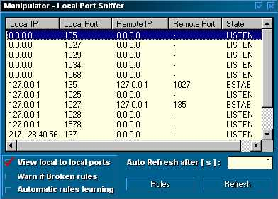



## Local Port Sniffer ::

### Description

A simple application to monitor TCP connections and to put warn rules. Can be used in complement with my other networks apps.
 
### More Info
 

             |
---                |---
**Submitted On**   |2001-10-14 10:54:30
**By**             |[El Manipulator](https://github.com/Planet-Source-Code/PSCIndex/blob/master/ByAuthor/el-manipulator.md)
**Level**          |Beginner
**User Rating**    |4.6 (23 globes from 5 users)
**Compatibility**  |VB 6\.0
**Category**       |[Internet/ HTML](https://github.com/Planet-Source-Code/PSCIndex/blob/master/ByCategory/internet-html__1-34.md)
**World**          |[Visual Basic](https://github.com/Planet-Source-Code/PSCIndex/blob/master/ByWorld/visual-basic.md)
**Archive File**   |[Local Port2894410142001\.zip](https://github.com/Planet-Source-Code/el-manipulator-local-port-sniffer__1-28076/archive/master.zip)

